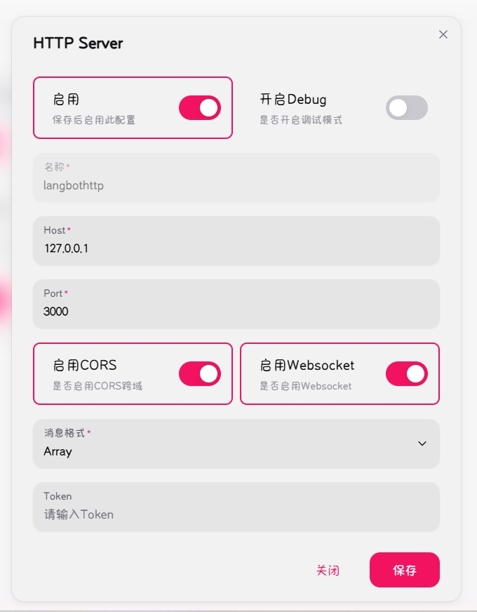

# HelloPlugin

<p align="center">  </p>

## 安装

配置完成 [LangBot](https://github.com/RockChinQ/LangBot) 主程序后使用管理员账号向机器人发送命令即可安装：

```
!plugin get https://github.com/sheetung/Msg2Forward
```
或查看详细的[插件安装说明](https://docs.langbot.app/plugin/plugin-intro.html#%E6%8F%92%E4%BB%B6%E7%94%A8%E6%B3%95)

## 使用

仅是配QQ端且平台使用napcat

按照如图添加napcat网络配置

<p align="center">  </p>